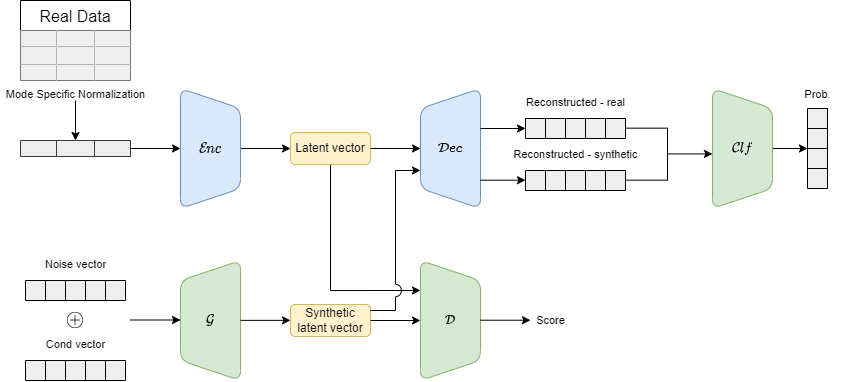

# AE-CTGAN
[CTGAN](https://arxiv.org/abs/1907.00503) relies on the use of sparse conditional vectors as the input to the generative model. This project is a continuation of [AE-GAN](https://arxiv.org/abs/2211.09286) to use pre-trained autoencoders to generate compact input representations. [Autoencoders](https://arxiv.org/abs/2003.05991), [variational autoencoders](https://arxiv.org/abs/1312.6114), and autoencoders with [entity embeddings for categorical variables](https://arxiv.org/abs/1604.06737) were used. 

# Architecture

